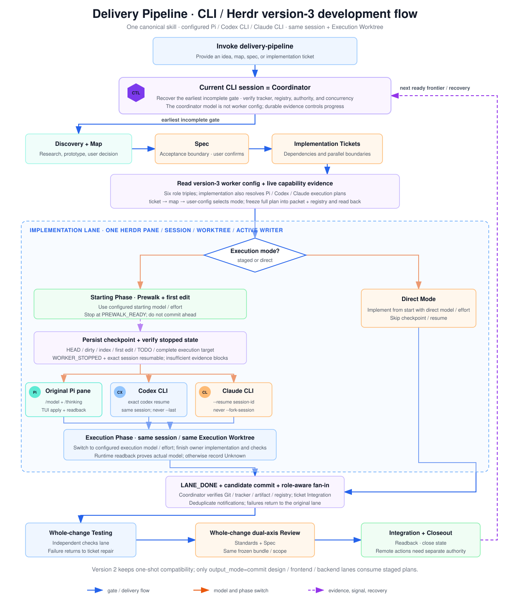
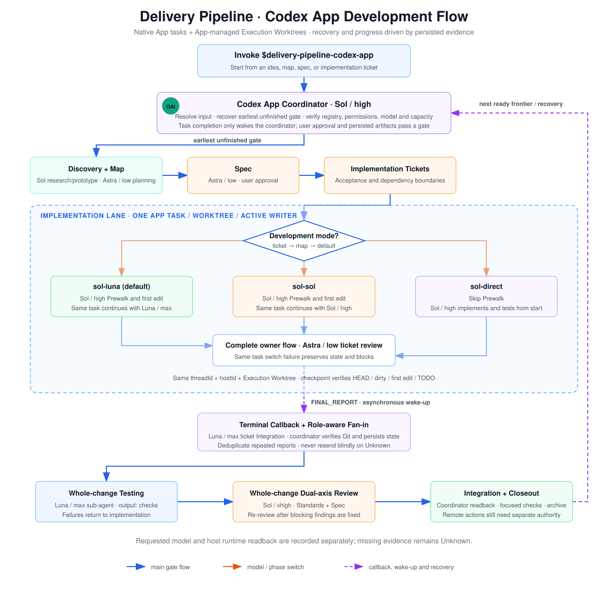

# Delivery Pipeline

[中文说明](README.zh-CN.md)

A resumable, configuration-driven multi-runtime delivery chain:

```text
idea/map -> discovery -> spec -> implementation tickets
  -> configured CLI/worktree dispatch -> integration -> testing -> review -> summary PR/MR
```

`skills/delivery-pipeline` is the single canonical core chain, installed unchanged for pi,
Codex CLI, and Claude CLI, and read by three peer transport shells. The calling session is the
coordinator; worker agent/model/effort comes from user configuration. CLI/Herdr delivery enters
through `delivery-pipeline-herdr` with all Herdr-specific packets and references co-located in
that shell. Codex App native tasks/worktrees remain an explicit transport exception,
exposed by `delivery-pipeline-codex-app` with all App-specific packets and references co-located
inside that shell. `delivery-pipeline-orca` is a separate, Orca-bound entrypoint: it reads the
active binary's version-matched guides and blocks with `dispatch unavailable` when runtime,
discovery, worker-policy, identity, or operation capability evidence is missing. It never falls
back to Herdr or Codex App.

## Worker Configuration

Before the first CLI dispatch, run `delivery-pipeline-setup`. It probes each installed CLI for available models and effort sources, then has you explicitly choose `agent + model + effort` for each required task type and the review matrix:

```text
planning  design  frontend  backend  testing  review(implementation/whole-change × standards/spec)
```

Configuration lives at `~/.config/delivery-pipeline/model-roles.json` (version 4); the schema is
defined once in `skills/delivery-pipeline/references/model-config-schema.md` and shared with the Codex App
shell's `config/models.json`. Named `modes` presets carry staged/direct model/effort pairs per agent; new
implementation lanes freeze their mode selection and existing lanes recover from their registry. Skills
contain no default models: missing, unknown, or invalid configuration blocks dispatch and re-enters setup.
The coordinator is not configured — whichever agent/model invoked the skill remains coordinator. Per-agent
lane kinds and runtime mapping are owned by
`skills/delivery-pipeline-herdr/references/dispatch-runtime-routing.md`.

## Dependencies

- At least one of pi, Codex CLI, or Claude CLI as coordinator; every worker CLI named in config must exist.
- Herdr CLI as the canonical core's terminal multiplexer.
- Orca CLI for the independent `delivery-pipeline-orca` entrypoint; its current-runtime
  `orca-cli` and `orchestration` guides must be readable.
- Owner skills: the machine-readable list is `skill-bundle.json` (`requires`); the installer diagnoses
  owners and all four CLIs without blocking installation.

## Install

```bash
./scripts/install.sh --target all
```

The installer symlinks the same `skills/delivery-pipeline` directory into Codex, Claude, and pi
skill homes, installs setup and `delivery-pipeline-herdr` in all three, and exposes `delivery-pipeline-orca` in those same native
skill discovery directories. Codex additionally receives `delivery-pipeline-codex-app`. The pre-commit validator is installed by default; pass `--no-hooks`
to skip it.

Before first use in a project repo, also run `setup-matt-pocock-skills` for tracker, triage, and
domain-doc configuration. That is separate from `delivery-pipeline-setup` worker routing.

## Use

### pi / Codex CLI / Claude CLI

Initialize once:

```text
Use delivery-pipeline-setup to initialize or reconfigure worker routing.
```

Then invoke the canonical `delivery-pipeline` with any map/spec/ticket issue. It reconstructs the
chain from tracker relationships and dispatches planning/design/frontend/backend/testing/review
lanes according to the frozen configuration. New Herdr lanes stay in the
coordinator's current workspace by default; a new workspace is created only when the user explicitly
requests one.

#### CLI / Herdr version-3 development flow

The flow below shows version-3 configuration and capability evidence, ticket → map → user-config mode
selection, staged/direct execution, same-session continuation for Pi/Codex/Claude, terminal fan-in,
and whole-change closeout.

[](docs/images/delivery-pipeline-cli-v3-flow.en.svg)

### Codex App

```text
Use $delivery-pipeline-codex-app with <any-map-spec-or-ticket-issue>.
```

The App shell uses native tasks and App-managed Execution Worktrees and does not read the CLI worker
role configuration. To use Herdr from a Codex App session, exit the App shell and invoke canonical
`delivery-pipeline`.

All App model selections live in
[config/models.json](skills/delivery-pipeline-codex-app/config/models.json), read from the skill realpath
(including symlink installations); no project `.codex/config.toml` copy is needed. New lanes freeze their
plans; configuration changes do not alter running lanes. Work entry, overrides, and recovery: [App
development contract](skills/delivery-pipeline-codex-app/references/development-mode.md).

#### Codex App development flow

The flow below shows gate recovery, configured implementation modes, same-task Prewalk continuation,
terminal fan-in, separate whole-change testing, scope-aware dual-axis review, and Integration closeout.

[](docs/images/delivery-pipeline-codex-app-flow.en.svg)

### Orca

```text
Use $delivery-pipeline-orca with <any-map-spec-or-ticket-issue>.
```

The Orca entrypoint reuses the same version 4 CLI worker configuration and owner contracts. Each
operation fixes one Orca executable, reads that binary's version-matched `orca-cli`/`orchestration` guides,
and verifies runtime, target host, terminal identity, exact `skills installed --json` discovery, and the
operation's capabilities. Shared agent/model/effort fields are caller-declared evidence pointers; helpers
are pure validators: structural success is `preflight-ready` with `authority: false`, and the
coordinator authorizes only after reading the native source. Missing or Unknown evidence returns a visible
`blocked` / `dispatch unavailable`; the entrypoint never falls back to Herdr/Codex App, and installation
plus static validation do not prove a live Orca operation. The dispatch, batch-concurrency, and FIFO
settlement contract lives in `skills/delivery-pipeline-orca/references/orca-dispatch.md`.

## Invariants

- The coordinator pane remains a control plane; isolated worktrees carry branch and file changes.
- One Execution Worktree, lane, and active writer per work item.
- Ordinary repository path overlap is an Integration risk, not an implicit dispatch dependency.
- Same-batch startup readback completes before Dispatch Handoff; long workers do not occupy coordinator time.
- Terminal fan-in trusts Git, tracker, artifacts, and registry evidence.
- Push/main/PR/MR/merge/final publication requires separate remote authority.

## Verify

```bash
python3 scripts/validate.py
```

The same validator is enforced by the pre-commit hook and CI (`.github/workflows/validate.yml`).
