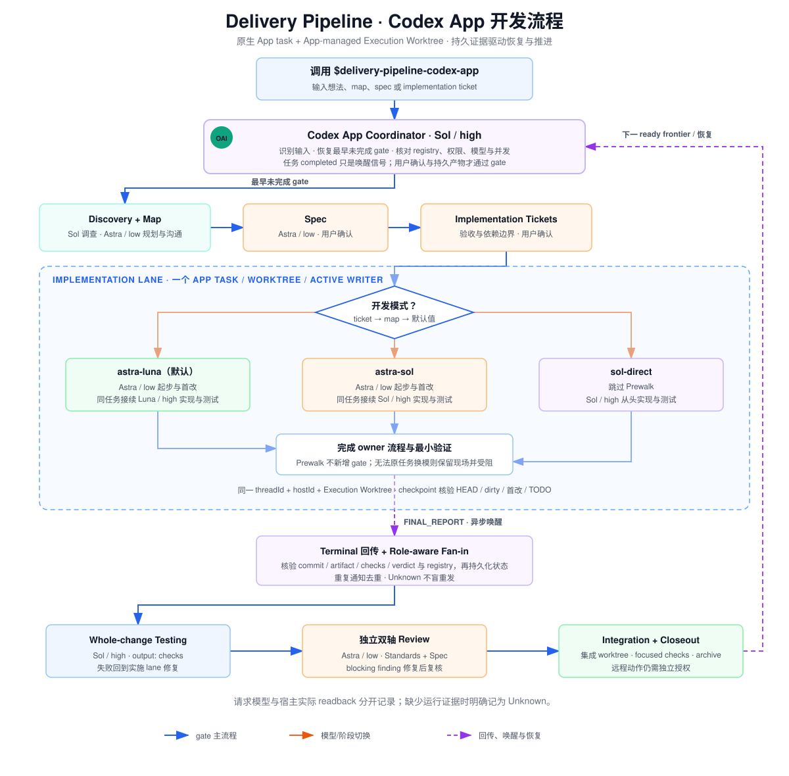

# Delivery Pipeline

[English README](README.md)

一个可恢复、配置驱动的多 runtime 交付链：

```text
idea/map -> discovery -> spec -> implementation tickets
  -> configured CLI/worktree dispatch -> integration -> testing -> review -> summary PR/MR
```

`skills/delivery-pipeline` 是唯一 canonical CLI/Herdr 主干，同一份物理 skill 供 pi、Codex CLI、
Claude CLI 使用。当前调用会话就是 coordinator；worker agent/model/effort 由用户级配置决定。
Codex App native task/worktree 是唯一特殊 transport，入口为 `delivery-pipeline-codex-app`，其 packet
与 references 全部共置在该壳内。

## Worker 配置

首次 CLI Dispatch 前运行 `delivery-pipeline-setup`。它探测：

- pi：`pi --list-models`
- Codex CLI：`codex debug models`
- Claude CLI：`~/.claude/settings.json` 的 `env` 模型映射与 effort

然后要求用户为六个角色明确选择 `agent + model + effort`：

```text
planning  design  frontend  backend  testing  review
```

配置写入 `~/.config/delivery-pipeline/model-roles.json`（version 2 兼容层；需要阶段计划时显式升级到 version 3）。
Skill 不包含默认模型；配置缺失、未知 version、缺角色或字段非法都会阻塞派发并重新进入 setup。
version 3 为三个 CLI agent 显式保存 staged/direct 的 starting、execution、direct model/effort；
新 implementation lane 按本票 → map → 用户配置冻结选择，旧 v2 与已有 lane 不自动迁移。Coordinator 不在配置中，
当前会话使用什么 agent/model，就由什么 agent/model 负责调度。

agent 决定 lane kind：

- pi → `herdr-pi-pane`
- codex → `herdr-codex-pane`
- claude → `herdr-claude-pane`

## 依赖

- pi、Codex CLI、Claude CLI 中至少安装一个作为 coordinator；配置引用的 worker CLI 必须存在。
- Herdr CLI：canonical CLI 主干的 terminal multiplexer。
- Owner skills：`wayfinder`、`grilling`、`domain-modeling`、`prototype`、`research`、`to-spec`、
  `to-tickets`、`implement`、`code-review`、`resolving-merge-conflicts`。

机器可读清单在 `skill-bundle.json` 的 `requires`；安装器末尾会诊断 owner skills 和四个 CLI。

## 安装

```bash
./scripts/install.sh --target all
```

安装器把同一个 `skills/delivery-pipeline` 软链到 Codex、Claude 与 pi skill home；setup 也安装到
三端。Codex 额外获得 `delivery-pipeline-codex-app`。默认安装 pre-commit validator；
`--no-hooks` 可跳过。

首次使用项目 repo 前，还需运行 `setup-matt-pocock-skills`，配置 owner skills 使用的 tracker、
triage labels 与 domain docs；这与 worker model routing 的 `delivery-pipeline-setup` 是两件事。

## 使用

### pi / Codex CLI / Claude CLI

先初始化一次：

```text
使用 delivery-pipeline-setup 初始化或重配 worker 路由。
```

随后在任一 CLI 中用 canonical `delivery-pipeline` 继续 map/spec/ticket。Skill 会沿 tracker
relationships 从最早未完成 gate 恢复，并按配置派发 planning/design/frontend/backend/testing/review
lanes。新 Herdr lane 默认留在 coordinator 当前 Workspace；只有用户显式要求时才创建新 Workspace。

### Codex App

```text
使用 $delivery-pipeline-codex-app 继续 <任意 map/spec/ticket issue>。
```

App 壳使用 native task + App-managed Execution Worktree，不读取 CLI worker-role config。若希望
Codex App 会话改走 Herdr，退出 App 壳并调用 canonical `delivery-pipeline`。

新实施票默认 `sol-luna`（Sol high → Luna max），可在调用时指定“本票 `sol-sol`”或“后续新票 `sol-direct`”。
所有模型、思考档位和 fast 设置均为参考默认值，用户可按任务、阶段或 map 覆盖；协调任务推荐 Sol/high。
Prewalk 在同一任务历史中接续。实施票 Review 使用 Astra low，whole-change Review 使用 Sol xhigh；
whole-change Testing 与逐票 Integration 分开使用 Luna max 子代理。每次调用都执行模型、内部并发与权限核验；本仓项目配置
不会随 Skill 软链应用到其他仓库。具体入口与证据边界见
[App 开发模式](skills/delivery-pipeline-codex-app/references/development-mode.md)。

#### Codex App 开发流程

下图覆盖 gate 恢复、三种实施模式、同任务 Prewalk 接续、终态 fan-in、独立 whole-change 测试、
按 scope 分配的双轴 Review 与 Integration 收尾。

[](docs/images/delivery-pipeline-codex-app-flow.zh-CN.svg)

## 不变量

- Coordinator Pane 只承担调度；branch 与文件修改都发生在隔离 worktree。
- 每个 work item 一个 Execution Worktree、一个 lane、一个 active writer。
- ready frontier 的普通 repo 路径重叠留给 Integration，不隐式串行。
- 同批 startup readback 后统一 Dispatch Handoff；长任务不持续占用 coordinator。
- terminal fan-in 以 Git、tracker、artifact 和 registry 为证据。
- push/main/PR/MR/merge/final publication 需要独立 remote authority。

## 校验

```bash
python3 scripts/validate.py
```

同一个 validator 由 pre-commit hook 与 CI（`.github/workflows/validate.yml`）强制执行。
