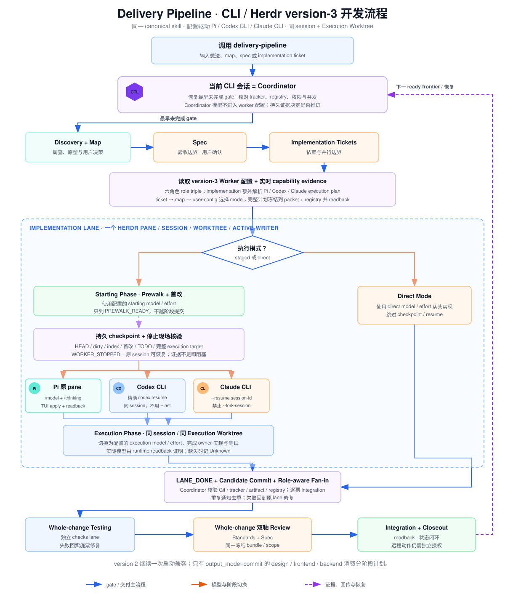

# Delivery Pipeline

[English README](README.md)

一个可恢复、配置驱动的多 runtime 交付链：

```text
idea/map -> discovery -> spec -> implementation tickets
  -> configured CLI/worktree dispatch -> integration -> testing -> review -> summary PR/MR
```

`skills/delivery-pipeline` 是唯一 canonical 核心链路，同一份物理 skill 被三个平级 transport
壳读取。当前调用会话就是 coordinator；worker agent/model/effort 由用户级配置决定。
CLI/Herdr 交付入口为 `delivery-pipeline-herdr`，其 packet 与 references 全部共置在该壳内。
Codex App native task/worktree 保持显式特殊 transport，入口为 `delivery-pipeline-codex-app`，其
packet 与 references 全部共置在该壳内。`delivery-pipeline-orca` 是严格绑定 Orca 的独立入口：
读取当前 binary 的 version-matched guide；runtime、discovery、worker policy、identity 或当前
operation capability 缺证据时明确返回 `dispatch unavailable`，不 fallback 到 Herdr/Codex App。

## Worker 配置

首次 CLI Dispatch 前运行 `delivery-pipeline-setup`。它探测：

- pi：`pi --list-models`
- Codex CLI：`codex debug models`
- Claude CLI：`~/.claude/settings.json` 的 `env` 模型映射与 effort

然后要求用户为每个必需任务类型与 review 矩阵明确选择 `agent + model + effort`：

```text
planning  design  frontend  backend  testing  review(implementation/whole-change × standards/spec)
```

配置写入 `~/.config/delivery-pipeline/model-roles.json`（version 4；与 Codex App 壳的
`config/models.json` 共用 `skills/delivery-pipeline/references/model-config-schema.md` 定义的同一份 schema）。
命名 `modes` 预设按 agent 保存 staged/direct 的 starting、execution、direct model/effort；
新 implementation lane 按本票 → map → 配置 `default_mode` 冻结 mode 名选择，已有 lane 沿 registry 恢复不迁移；
旧版本配置由 `model_config.py migrate` 机械迁移。
Skill 不包含默认模型；配置缺失、未知 version、缺任务类型或字段非法都会阻塞派发并重新进入 setup。
Coordinator 不在配置中，当前会话使用什么 agent/model，就由什么 agent/model 负责调度。

agent 决定 lane kind：

- pi → `herdr-pi-pane`
- codex → `herdr-codex-pane`
- claude → `herdr-claude-pane`

## 依赖

- pi、Codex CLI、Claude CLI 中至少安装一个作为 coordinator；配置引用的 worker CLI 必须存在。
- Herdr CLI：canonical CLI 主干的 terminal multiplexer。
- Orca CLI：独立 `delivery-pipeline-orca` 入口；必须能从当前 runtime 读取 version-matched
  `orca-cli` 与 `orchestration` guide。
- Owner skills：`wayfinder`、`grilling`、`domain-modeling`、`prototype`、`research`、`to-spec`、
  `to-tickets`、`implement`、`code-review`、`resolving-merge-conflicts`。

机器可读清单在 `skill-bundle.json` 的 `requires`；安装器末尾会诊断 owner skills 和四个 CLI。

## 安装

```bash
./scripts/install.sh --target all
```

安装器把同一个 `skills/delivery-pipeline` 软链到 Codex、Claude 与 pi skill home；setup、
`delivery-pipeline-herdr` 与 `delivery-pipeline-orca` 也安装到三端各自的原生 discovery 目录。Codex 额外获得
`delivery-pipeline-codex-app`。默认安装 pre-commit validator；
`--no-hooks` 可跳过。

首次使用项目 repo 前，还需运行 `setup-matt-pocock-skills`，配置 owner skills 使用的 tracker、
triage labels 与 domain docs；这与 worker model routing 的 `delivery-pipeline-setup` 是两件事。

## 使用

### pi / Codex CLI / Claude CLI

先初始化一次：

```text
使用 delivery-pipeline-setup 初始化或重配 worker 路由。
```

随后在任一 CLI 中用 canonical `delivery-pipeline` 继续 map/spec/ticket。Skill 会沿 tracker
relationships 从最早未完成 gate 恢复，并按配置派发 planning/design/frontend/backend/testing/review
lanes。新 Herdr lane 默认留在 coordinator 当前 Workspace；只有用户显式要求时才创建新 Workspace。

#### CLI / Herdr version-3 开发流程

下图覆盖 version-3 配置与 capability evidence、ticket → map → user config 模式选择、staged/direct
实施、Pi/Codex/Claude 同 session 接续、终态 fan-in 与 whole-change 收尾。

[](docs/images/delivery-pipeline-cli-v3-flow.zh-CN.svg)

### Codex App

```text
使用 $delivery-pipeline-codex-app 继续 <任意 map/spec/ticket issue>。
```

App 壳使用 native task + App-managed Execution Worktree，任务类型全部绑定 `agent: codex-app` 的独立配置实例。若希望
Codex App 会话改走 Herdr，退出 App 壳并调用 canonical `delivery-pipeline`。

App 模型统一在 [config/models.json](skills/delivery-pipeline-codex-app/config/models.json) 修改。
Prewalk 默认模式为 `astra-sol`；可选模式、阶段模型和档位以配置为准。配置随 skill realpath 读取，
不需要向业务仓库复制 `.codex/config.toml`。新 lane 冻结计划；配置修改不改变已运行的 lane。

查询全部配置（JSON stdin；`model` 命令可用 `{"work":"planning"}` 查询单项）：

```sh
python3 skills/delivery-pipeline-codex-app/scripts/prewalk.py models <<<'{}'
```

工作入口、覆盖参数与恢复边界见 [App 开发模式](skills/delivery-pipeline-codex-app/references/development-mode.md)。

#### Codex App 开发流程

下图覆盖 gate 恢复、配置的实施模式、同任务 Prewalk 接续、终态 fan-in、独立 whole-change 测试、
按 scope 分配的双轴 Review 与 Integration 收尾。

[](docs/images/delivery-pipeline-codex-app-flow.zh-CN.svg)

### Orca

```text
使用 $delivery-pipeline-orca 继续 <任意 map/spec/ticket issue>。
```

Orca 入口复用同一 version 4 CLI worker 配置与 owner 合同。每次 operation 前只固定一个
Orca executable，读取该 binary 的 version 与 `orca-cli`/`orchestration` guide 并记录精确原生
命令来源，然后核对 runtime ready/reachable/connected、与 status 绑定的目标 host、当前 terminal
identity、`skills installed --json` 精确发现，以及本次要求的 command/runtime capabilities。shared
agent/model/effort 与 same-session 字段只是 caller-declared evidence 指针：helper 校验结构、绑定和
可读绝对 source path；coordinator 必须读回原生 source 后才可授权。结构成功只返回 `preflight-ready` 与
`authority: false`。证据缺失或 Unknown 即明确 blocked；不映射 agent、不把 staged 降级为
direct、不新增配置/安装器/dispatcher，也不 fallback 到 Herdr/Codex App。安装与静态
validator 通过不证明 Orca 真机 operation 可运行。

## 不变量

- Coordinator Pane 只承担调度；branch 与文件修改都发生在隔离 worktree。
- 每个 work item 一个 Execution Worktree、一个 lane、一个 active writer。
- ready frontier 的普通 repo 路径重叠留给 Integration，不隐式串行。
- 同批 startup readback 后统一 Dispatch Handoff；长任务不持续占用 coordinator。
- terminal fan-in 以 Git、tracker、artifact 和 registry 为证据。
- push/main/PR/MR/merge/final publication 需要独立 remote authority。

## 校验

```bash
python3 scripts/validate.py
```

同一个 validator 由 pre-commit hook 与 CI（`.github/workflows/validate.yml`）强制执行。
